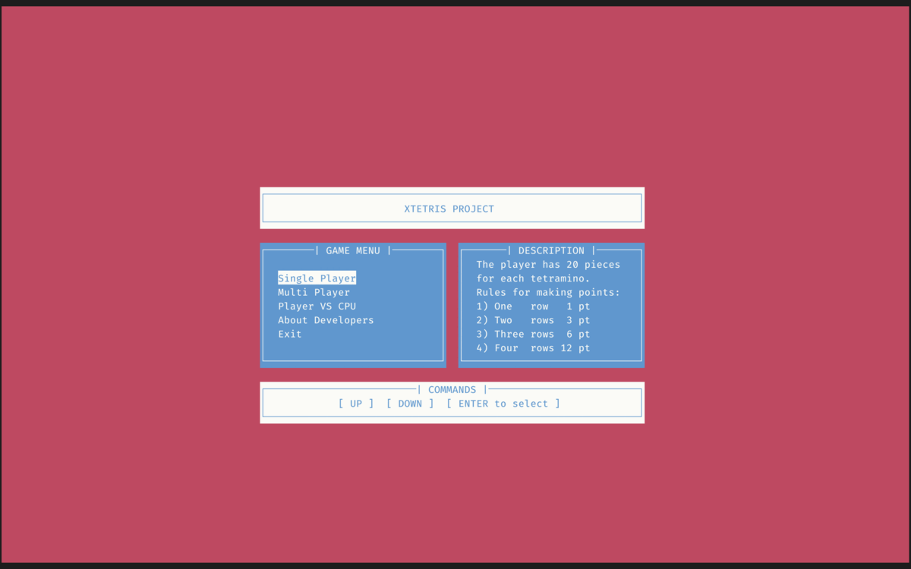

#+TITLE: XTETRIS
#+AUTHOR: jcostd, mastrodeimastri, Blast291

* 🕹️ XTETRIS - Advanced Terminal Tetris

XTETRIS is a highly portable, cross-platform Tetris clone written entirely in pure *C*. It runs directly in your terminal using =ncurses= and features background audio playback via =miniaudio=.

Tested and verified on modern Linux, macOS, BSD, and even legacy PowerPC Mac G4 hardware.

** 📸 Visuals

** ⚙️ Features
- *100% C and ncurses*: Lightweight, fast, and terminal-native.
- *Cross-Platform Makefile*: Automatically detects your OS (Linux, Darwin, BSD, Windows) and links the correct libraries.
- *Audio Engine*: Uses =miniaudio= for non-blocking background music (BGM).
- *Modes*: Single-player and Multi-player support.

** 💾 Installation & Build

You need a C compiler (=gcc= or =clang=) and the =ncurses= development headers.

*** 1. Install Dependencies

*macOS* (via Homebrew):
#+BEGIN_SRC bash
brew install ncurses
#+END_SRC

*Debian / Ubuntu*:
#+BEGIN_SRC bash
sudo apt-get install libncurses5-dev libncursesw5-dev
#+END_SRC

*Fedora / RHEL*:
#+BEGIN_SRC bash
sudo dnf install ncurses-devel
#+END_SRC

*FreeBSD*:
#+BEGIN_SRC bash
sudo pkg install ncurses
#+END_SRC

*** 2. Compile
Just run =make=. The Makefile will handle OS detection automatically.
#+BEGIN_SRC bash
make
#+END_SRC

*** 3. Play
Run the executable passing the background music file as an argument, or simply use the Make target:
#+BEGIN_SRC bash
make run
#+END_SRC

** 👥 Authors
- [[https://github.com/jcostd][Jacopo Costantini]] (jcostd)
- [[https://github.com/mastrodeimastri][Alvise Silvestri]]
- [[https://github.com/Blast291][Matteo Zambon]]

*Note: This project is part of a university assignment. The code is kept as-is for historical reference.*
